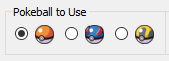
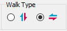
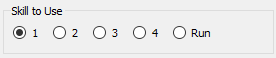
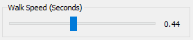
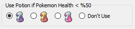
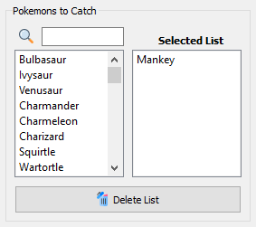
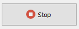

<a name="readme-top"></a>
<!-- PROJECT LOGO -->
<br />
<div align="center">
  <a href="https://github.com/hkturan/Pokemon-Game-Bot">
    
  </a>

<h3 align="center">Pokemon Game Bot</h3>

  <p align="center">
    Pokemon Game Bot With Python Libraries
    <br />
    
  </p>
</div>

<!-- TABLE OF CONTENTS -->
<details>
  <summary>Table of Contents</summary>
  <ol>
    <li>
      <a href="#about-the-project">About The Project</a>
      <ul>
        <li><a href="#built-with">Built With</a></li>
      </ul>
    </li>
    <li>
      <a href="#getting-started">Getting Started</a>
      <ul>
        <li><a href="#installation">Installation</a></li>
      </ul>
    </li>
    <li><a href="#usage">Usage</a></li>
    <li><a href="#license">License</a></li>
    <li><a href="#contact">Contact</a></li>
  </ol>
</details>

<!-- ABOUT THE PROJECT -->
## About The Project

[![Product Name Screen Shot][product-screenshot]](https://raw.githubusercontent.com/hkturan/Pokemon-Game-Bot/main/images/screenshot.png)

The project was developed to use python libraries for the game 'Pokemon Planet'. It will not be used for cheating. Project's abilities:

* Automatically finds and fights pokemon
* Catches which pokemon you want (`Optional`)
* Uses potion when the Pokemon health's is below 50% (`Optional`)
* Uses which skill you want used
* Sets your character's walking time
* Saves your bot settings for your next use

**[⬆ back to top](#readme-top)**

<!-- MARKDOWN LINKS & IMAGES -->
[product-screenshot]: images/github/screenshot.png

### Built With

* 
*  

**[⬆ back to top](#readme-top)**

<!-- GETTING STARTED -->
## Getting Started

### Installation

1. Clone the repo
   ```sh
   git clone https://github.com/hkturan/Pokemon-Game-Bot.git
   ```
2. Install Python libraries
   ```sh
   pip install PyQt5
   pip install opencv-python
   pip install pytesseract
   pip install Pillow
   pip install pyautogui
   pip install pywin32
   ```
3. Download Tesseract-OCR, Install and Set Path in `json/settings.json` (Key : "path_of_tesseract")


   * For Win32 - https://digi.bib.uni-mannheim.de/tesseract/tesseract-ocr-w32-setup-v5.2.0.20220712.exe
   * For Win64 - https://digi.bib.uni-mannheim.de/tesseract/tesseract-ocr-w64-setup-v5.2.0.20220712.exe
   
4. Download Game (1600x900 must be downloaded)

  
  * Pokemon Planet - https://pokemon-planet.com/


**[⬆ back to top](#readme-top)**

<!-- USAGE EXAMPLES -->
## Usage

1. Open Pokemon Planet and Go to a place where you can find pokemon

2. Run `main.py`

3. Choose Pokeball - Used to catch pokemon (`Pokeball`, `Great Ball` and `Ultra Ball`)

* 

4. Choose Walk Type - Determines the direction the character will go (`Up-Down` and `Left-Right`

* 

5. Choose Skill - Determines the skill to be used in battle.
If you want to get out without a fight, choose to `Run`

* 

6. Set Walk Speed - Determines how many seconds the character will walk in one direction

* 

7. Choose Potion - Used when the Pokemon health's is below 50%. If you don't want to use it, choose `Don't Use` (`Potion`, `Super Potion` and `Hyper Potion`)

* 

8. Select Pokemons - Determines which pokemons to catch

* 

9. <b>Click Start and Get Enjoy!</b>

* 

Note : You can stop the bot at any time while the bot is running using the `Stop` button

* 

**[⬆ back to top](#readme-top)**

## License

[](./LICENSE)

Distributed under the MIT License. See LICENSE.txt for more information.

**[⬆ back to top](#readme-top)**

<!-- CONTACT -->
## Contact

Hasan Kaan TURAN  - hasankaanturan33@gmail.com

**[⬆ back to top](#readme-top)**
